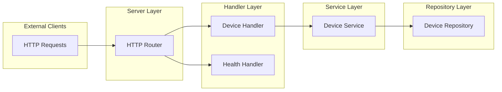

# Signature Service

A service for managing cryptographic signature devices and message signing.

## Key Features
- Device management (create, list, retrieve)
- Message signing with registered devices
- RESTful API with JSON responses
- Containerized deployment support

## API Reference

### Device Management
| Method | Endpoint                        | Description                    |
|--------|---------------------------------|--------------------------------|
| GET    | `/api/v0/devices`               | List all registered devices    |

| Method | Endpoint                        | Description                    |
|--------|---------------------------------|--------------------------------|
| GET    | `/api/v0/devices/{deviceID}`    | Get retrieve a device             |

| Method | Endpoint                        | Description                    |
|--------|---------------------------------|--------------------------------|
| POST   | `/api/v0/devices/`        | Register a new device          |

| Method | Endpoint                        | Description                    |
|--------|---------------------------------|--------------------------------|
| POST   | `/api/v0/devices/{deviceID}/sign`| Sign a message using device   |

### Health Check
| Method | Endpoint           | Description        |
|--------|--------------------|--------------------|
| GET    | `/api/v0/health`   | Service heartbeat  |

## Running the Service

The service can be run locally with:

```bash
go run main.go
```

Or using docker:

```bash
# Build the image
docker build -t signature-device-service:latest -f Dockerfile .
# Run the container
docker run --rm signature-device-service:latest
```

The service will start on port `8080`.

## Testing

Both unit and integration testing are performed using the go's testing primitives. 
 - `domain/service_test.go`: tests business logic to adhere to the specifications
 - `main_test.go`: end-to-end testing for performing integration testing.   


Run the tests locally with:

```bash
go test ./...
```

Or using docker:

```bash
# Build test image
docker build -t signature-device-service-test:latest -f Dockerfile.test .
# Run tests
docker run --rm signature-device-service-test:latest
```

## Architecture

The service follows a layered architecture pattern:

1. Server Layer
   - HTTP server and routing
   - Middleware management
   - Request handling

2. Handler Layer
   - API endpoint handlers
   - Request/response processing
   - Input validation

3. Service Layer
   - Business logic implementation
   - Core functionality

4. Repository Layer
   - Data persistence
   - Storage interface




## Design Decisions

The service prioritizes:
- Scalability for future business logic expansion
- Code maintainability and readability
- Test-friendly architecture
- Clean separation of concerns
- Minimal external dependencies

## Improvements and Limitations

For transparency, the following features are not currently implemented:
- Comprehensive tests and full coverage 
- Context (`context.Context`) propagation in business logic
- Timeout logic and errors where external services are called
- Comprehensive error wrapping and logging
- Configuration the service via CLI parameters
- Other limitations/improvement are expressed using `TODO` in comments
