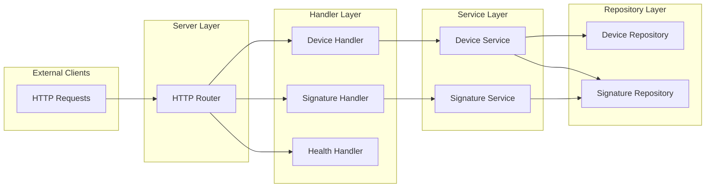

# Signature Service

A service for managing cryptographic signature devices and message signing.

## Key Features
- Device management (create, list, retrieve)
- Message signing with registered devices
- Signature management (list, retrieve)
- RESTful API with JSON responses
- Containerized deployment support

## API Reference

Here are the implemented endpoints grouped by their usage. 

### Device Management
| Method | Endpoint                        | Description                    |
|--------|---------------------------------|--------------------------------|
| GET    | `/api/v0/devices`               | List all registered devices    |


<details>
<summary>Show example</summary>

`curl 'http://localhost:8080/api/v0/devices'`

```json
{
  "data": [
    {
      "id": "73771234-55ec-4540-92c4-f09eee812f07",
      "algorithm": "RSA",
      "label": "my-label"
    }
  ]
}
```
</details>

| Method | Endpoint                        | Description                    |
|--------|---------------------------------|--------------------------------|
| GET    | `/api/v0/devices/{deviceID}`    | Retrieve a device             |

<details>
<summary>Show example</summary>

`curl 'http://localhost:8080/api/v0/devices/73771234-55ec-4540-92c4-f09eee812f07'`

```json
{
  "data": {
    "id": "73771234-55ec-4540-92c4-f09eee812f07",
    "algorithm": "RSA",
    "label": "Ciao"
  }
}
```
</details>

| Method | Endpoint                        | Description                    |
|--------|---------------------------------|--------------------------------|
| POST   | `/api/v0/devices/`        | Register a new device          |


<details>
<summary>Show example</summary>

```bash
curl -X POST 'http://localhost:8080/api/v0/devices/' \
--header 'Content-Type: application/json' \
--data '{
    "label": "my-label",
    "algorithm": "RSA"
}'
```

```json
{
  "data": {
    "id": "e770900e-004e-4a59-9e99-b388184e0c3f",
    "algorithm": "RSA",
    "label": "my-label"
  }
}
```
</details>

| Method | Endpoint                        | Description                    |
|--------|---------------------------------|--------------------------------|
| POST   | `/api/v0/devices/{deviceID}/sign`| Sign a message using device   |

<details>
<summary>Show example</summary>
```bash
curl -X POST 'http://localhost:8080/api/v0/devices/e770900e-004e-4a59-9e99-b388184e0c3f/sign' \
--header 'Content-Type: application/json' \
--data '{
    "message": "my message",
    "isBase64": false
}'
```

```json
{
  "data": {
    "id": "0aeee654-f99b-4f44-9e74-4333e75e0b8d",
    "device_id": "e770900e-004e-4a59-9e99-b388184e0c3f",
    "signature": "H1D4HfojObhgUjYeQ1Fj1umFMu2LPPo9urgP4OKQo0HSY/lLVosaJKvPqbyqGW6s+iePY3jQtKrAekOGKNh/BA==",
    "signed_data": "0_bXkgbWVzc2FnZQ==_ZTc3MDkwMGUtMDA0ZS00YTU5LTllOTktYjM4ODE4NGUwYzNm"
  }
}
```
</details>

### Signature Management

| Method | Endpoint                        | Description                    |
|--------|---------------------------------|--------------------------------|
| GET    | `/api/v0/signatures`               | List all created signatures    |


<details>
<summary>Show example</summary>

`curl 'http://localhost:8080/api/v0/signatures'`

```json
{
  "data": [
    {
      "id": "0aeee654-f99b-4f44-9e74-4333e75e0b8d",
      "device_id": "4b019dc4-2e96-4efd-b28d-4b761d66db9f",
      "signature": "wUvOXqD+i881q/v8vIfEZQvq+p/G5hY+ljv6pgUGl7hDOngdWI138FsxnFYZaPj6NwcRVhPauSVTuhfQI/gpjg==",
      "signed_data": "0_YWFh_NGIwMTlkYzQtMmU5Ni00ZWZkLWIyOGQtNGI3NjFkNjZkYjlm"
    }
  ]
}
```
</details>

| Method | Endpoint                        | Description                    |
|--------|---------------------------------|--------------------------------|
| GET    | `/api/v0/signatures/{signatureID}`    | Retrieve a signatures             |


<details>
<summary>Show example</summary>

`curl 'http://localhost:8080/api/v0/signatures/0aeee654-f99b-4f44-9e74-4333e75e0b8d'`

```json
{
  "data": {
    "id": "0aeee654-f99b-4f44-9e74-4333e75e0b8d",
    "device_id": "4b019dc4-2e96-4efd-b28d-4b761d66db9f",
    "signature": "wUvOXqD+i881q/v8vIfEZQvq+p/G5hY+ljv6pgUGl7hDOngdWI138FsxnFYZaPj6NwcRVhPauSVTuhfQI/gpjg==",
    "signed_data": "0_YWFh_NGIwMTlkYzQtMmU5Ni00ZWZkLWIyOGQtNGI3NjFkNjZkYjlm"
  }
}
```
</details>

### Health Check
| Method | Endpoint           | Description        |
|--------|--------------------|--------------------|
| GET    | `/api/v0/health`   | Service heartbeat  |

## Running the Service

The service can be run locally with:

```bash
go run main.go
```

Or using docker:

```bash
# Build the image
docker build -t signature-device-service:latest -f Dockerfile .
# Run the container
docker run --rm -p 8080:8080 signature-device-service:latest
```

The service will start on port `8080`.

## Testing

Both unit and integration testing are performed using the go's testing primitives. 
 - `domain/device_service_test.go`: tests business logic to adhere to the specifications
 - `main_test.go`: end-to-end testing for performing integration testing.   


Run the tests locally with:

```bash
go test ./...
```

Or using docker:

```bash
# Build test image
docker build -t signature-device-service-test:latest -f Dockerfile.test .
# Run tests
docker run --rm signature-device-service-test:latest
```

## Architecture

The service follows a layered architecture pattern:

1. Server Layer
   - HTTP server and routing
   - Middleware management
   - Request handling

2. Handler Layer
   - API endpoint handlers
   - Request/response processing
   - Input validation

3. Service Layer
   - Business logic implementation
   - Core functionality

4. Repository Layer
   - Data persistence
   - Storage interface




## Design Decisions

The service prioritizes:
- Scalability for future business logic expansion
- Code maintainability and readability
- Test-friendly architecture
- Clean separation of concerns
- Minimal external dependencies

## Improvements and Limitations

For transparency, the following features are not currently implemented:
- Comprehensive tests and full coverage 
- Context (`context.Context`) propagation in business logic
- Timeout logic and errors where external services are called
- Comprehensive error wrapping and logging
- Configuration the service via CLI parameters
- Other limitations/improvement are expressed using `TODO` in comments
